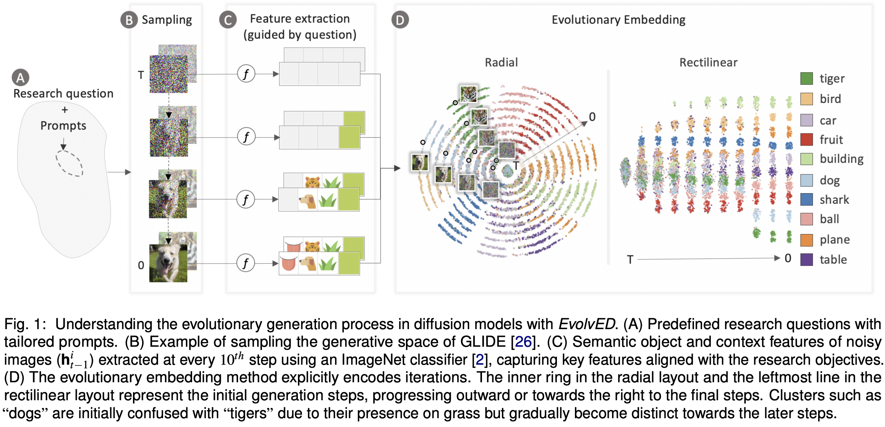

# EvolvED: Evolutionary Embeddings to Understand the Generation Process of Diffusion Models

EvolvED provides a method to **analyze and visualize the iterative generative process of diffusion models**. It produces low-dimensional embeddings that preserve semantic relations and track instance evolution over timesteps.


## Overview



- Diffusion models generate images iteratively from noise.  
- EvolvED provides a framework to analyze this evolutionary data. It encodes intermediate diffusion outputs over timesteps via an evolutionary embedding method.  
- EvolvED enhances the visualization of data evolution by:  
  - Clustering semantically similar elements within each iteration with t-SNE (Semantic Loss).  
  - Grouping elements by iteration (Displacement Loss).  
  - Aligning an instance’s elements across iterations (Alignment Loss).

## Repository
This repository contains code to generate the evolutionary embeddings with sample data. 

## Citation
If you use this code for your research, please cite our paper available here - https://arxiv.org/pdf/2406.17462. 
```
@article{prasad2024evolved,
  title={EvolvED: Evolutionary Embeddings to Understand the Generation Process of Diffusion Models},
  author={Prasad, Vidya and van Gorp, Hans and Humer, Christina and van Sloun, Ruud JG and Vilanova, Anna and Pezzotti, Nicola},
  journal={arXiv preprint arXiv:2406.17462},
  year={2024}
}
```
